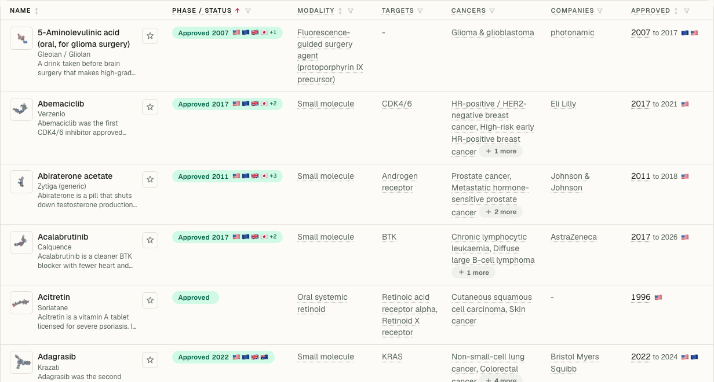
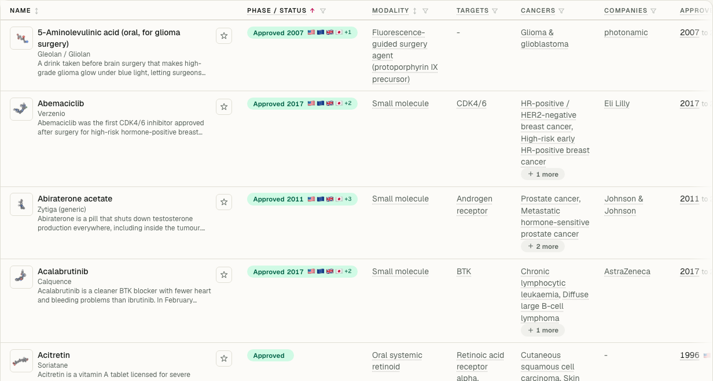
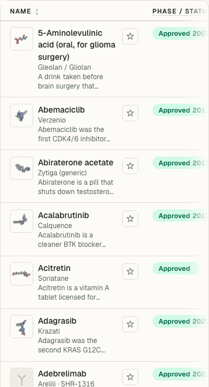
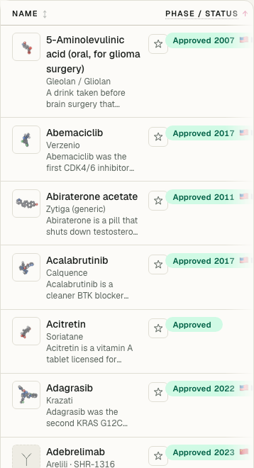
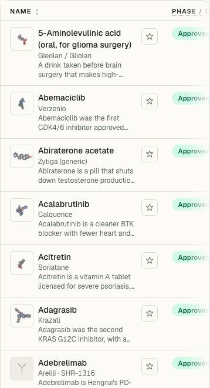

# Smart table column sizing review

These screenshots compare `/drugs/` at the unchanged base commit
`338fd7fecd61b73c9d78e9d81367a954e4740ac4` with this feature. Both runs use the
same default sort, English technical view, records, fonts and viewport. The
analytics prompt is dismissed in both. Images are cropped to the table and
are original browser screenshots. Resize dividers are hidden at rest and appear on
header hover, keyboard focus, or while dragging.

## Desktop: 1440 × 1000 viewport

| Before | After: automatic sizing |
| --- | --- |
|  |  |

| Automatic sizing | After dragging Name 130 pixels wider |
| --- | --- |
|  |  |

## Mobile: 390 × 844 viewport

| Before | After: automatic sizing |
| --- | --- |
|  |  |

| Automatic sizing | After dragging Name 60 pixels wider |
| --- | --- |
|  |  |

Browser checks verified matching rows, mouse and touch resizing, manual widths
surviving a real column filter, Home resetting the resized column, and the
results card staying within the viewport. Additional browser checks covered sorting, viewport changes, right-to-left
dragging and cleanup.
